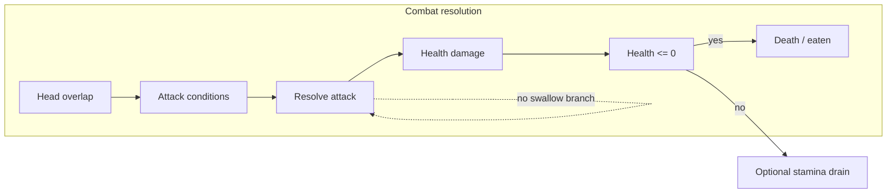

# Health-Based Combat, No Eat-Whole, and Hit/Death Impact

## Current state

- **Combat**: Stamina-only. Attacks drain stamina; exhausted → KO; KO + dash = eaten. No health used in [canvas-game-loop.ts](lib/game/canvas-game-loop.ts).
- **Eat whole**: Two separate instant-eat paths:
  - Fish–fish: `sizeRatio >= ATTACK_SIZE_RATIO` → prey eaten; `sizeRatio <= 1/ATTACK_SIZE_RATIO` → predator eaten ([lines 322–332](lib/game/canvas-game-loop.ts)).
  - Player–fish: `canSwallow` (player.size >= fish.size * 2) or `playerAttacking` with size advantage → fish removed and rewards applied ([lines 398–506](lib/game/canvas-game-loop.ts)).
- **Entities**: [FishEntity](lib/game/canvas-state.ts) and [PlayerEntity](lib/game/canvas-state.ts) have no `health`/`maxHealth`. Creature data and run-state have `health`/`damage`; [spawn-fish.ts](lib/game/spawn-fish.ts) returns `health`/`damage` but they are not on the canvas entities.
- **Animations**: [AnimationSprite](lib/rendering/animation-sprite.ts) has `triggerAction('bite'|'death'|'hurt')` and `drawToContext()` with no overlay. Renderer uses `playAction(desiredAction)` for idle/swim/dash/hurt (KO only); no per-frame hit flash or scale punch on entities.

## Architecture after changes

- All combat goes through: **attack → apply health damage → if health <= 0 then death/eaten (rewards)**. No branch that adds to `eatenIds` or splices fish based only on size ratio without health.
- “Eat whole” effect: When attacker is much larger, one attack can deal damage >= target’s health (one-shot); outcome is still “health <= 0 → eaten.”

---

## Part 1: Health-based combat, remove eat-whole

### 1.1 Add health to canvas entities

- **[canvas-state.ts](lib/game/canvas-state.ts)**  
  - On `FishEntity`: add `health: number`, `maxHealth: number`.  
  - On `PlayerEntity`: add `health: number`, `maxHealth: number`.
- **Init fish**: Where fish are created for the canvas (e.g. [canvas-game-loop.ts](lib/game/canvas-game-loop.ts) `addFishToState` ~1121 and any path that builds a `FishEntity` from creature data), set `health` and `maxHealth` from `creature.stats.health` (or creature loader default).
- **Init player**: Where the player is created or synced from run-state ([canvas-state.ts](lib/game/canvas-state.ts) `createInitialState` / `resetForRun` and any run-state sync), set `player.health` and `player.maxHealth` from `runState.fishState.health` (and upgrades if applied there).

### 1.2 Single attack resolution (health damage, no swallow branch)

- **New helper** (e.g. in [stamina-hunger.ts](lib/game/stamina-hunger.ts) or a small `combat.ts`):
  - `resolveAttack(attacker, target, options)`:  
    - Compute **health damage** from attacker (size, damage stat from creature/run-state) and target (size, maxHealth). Formula can mirror [entities.ts](lib/game/entities.ts) `calculateDamage` (size ratio multipliers) or a simplified version.  
    - Apply `target.health = max(0, target.health - damage)`.  
    - Optionally apply stamina cost to target (or attacker) via existing `applyStaminaCost` with a **modifier** (default 0 so bites do not drain stamina).  
    - Return whether target died (`target.health <= 0`).
- **Fish–fish collision** ([canvas-game-loop.ts](lib/game/canvas-game-loop.ts) ~260–346):
  - Remove the branches that do **instant eat** based only on size ratio:
    - Remove: `sizeRatio >= ATTACK_SIZE_RATIO` → `eatenIds.add(prey.id)` and size/hunger/bite.  
    - Remove: `sizeRatio <= 1/ATTACK_SIZE_RATIO` → `eatenIds.add(predator.id)` and size/hunger/bite.
  - Keep: KO + predator dashing → treat as an attack that can kill (e.g. deal damage; if prey already has 0 health or one-shot, then eaten).  
  - Replace one-sided and both-dashing logic with: on valid attack contact, call `resolveAttack`; if target died, add to `eatenIds`, grant size/hunger, bite VFX, blood; otherwise optionally apply stamina effects only if you keep stamina battles (e.g. both dashing = both take stamina cost, no health damage, until one is exhausted — then next hit can be health-based).  
  - Rule: **No removal from the array unless `target.health <= 0**` (or explicit death state). So “eat” = result of health reaching 0 after an attack.
- **Player–fish collision** ([canvas-game-loop.ts](lib/game/canvas-game-loop.ts) ~367–506):
  - Remove **swallow whole** as a separate condition: remove `canSwallow` and the branch that removes fish and grants rewards without going through health.  
  - Remove the branch where `playerAttacking` (including “can swallow”) immediately splices fish and gives rewards.  
  - Replace with: when player or fish is “attacking” (dash + size/conditions), call `resolveAttack`. If fish dies (health <= 0): remove fish, grant size/hunger/essence, bite, chomp particles, blood, run-state essence — same rewards as today but only after health reaches 0. If player dies (health <= 0): trigger game over, death animation.  
  - Large size advantage can still mean one attack deals enough damage to kill in one hit (one-shot); no separate “instant swallow” branch.
- **Constants**: [dash-constants.ts](lib/game/dash-constants.ts) — keep `ATTACK_SIZE_RATIO` for “who can attack whom”; you can stop using `SWALLOW_SIZE_RATIO` for logic (or use it only to scale damage so big attackers one-shot small prey). Do not use swallow ratio to skip health.

### 1.3 Decouple stamina from bites

- In `resolveAttack`, do **not** call `applyStaminaCost` on the target by default (or pass stamina cost 0). Stamina is drained only by dashing (existing `updateStamina`).  
- Optional later: add a parameter like `staminaCost?: number` (or modifier) so specific abilities can drain stamina on hit; for this plan, combat does not drain stamina on bite.

### 1.4 KO and death

- **Death**: Only when `health <= 0`. Remove any path that sets “eaten” or game over solely because stamina reached 0 (e.g. player.stamina <= 0 → game over). Player death = player.health <= 0; fish death = fish.health <= 0 then remove and grant rewards.  
- **KO**: You can keep exhausted/KO as a separate state (e.g. stamina 0 → slower move, vulnerable) and optionally “hit while exhausted = extra damage or instant kill” if desired; but the only way to **remove** a fish or end the run is health <= 0.

---

## Part 2: Hit and death impact (flash, scale, movement, death state)

Goal: Impact for **hit** (attacker and/or defender), **get hit**, and **death** using scaling, movement, and red/white flashes, without depending on fixing the sprite swap system first.

### 2.1 Per-entity hit flash and punch

- **State**: On `FishEntity` and `PlayerEntity`, add optional timestamps:
  - `hitFlashEndTime?: number` — end of hit flash overlay.
  - `hitPunchScaleEndTime?: number` — end of “punch” scale (optional; can derive from same as flash).
- **Game loop**: When applying damage in `resolveAttack`, set on the **target**:
  - `target.hitFlashEndTime = now + HIT_FLASH_DURATION` (e.g. 150–250 ms).  
  - Optionally `target.hitPunchScaleEndTime = now + same or shorter` and a scale value (e.g. 1.1–1.2) stored on entity or constant.
- **Constants**: In [canvas-constants.ts](lib/game/canvas-constants.ts) (e.g. under `RENDERING` or new `COMBAT`): `HIT_FLASH_DURATION`, `HIT_PUNCH_SCALE`, `HIT_PUNCH_DURATION` (if separate), `HIT_KNOCKBACK_STRENGTH`, `DEATH_STATE_DURATION`.

### 2.2 Knockback on hit

- In `resolveAttack`, after applying damage, add a small impulse to **target** velocity: direction from attacker to target, magnitude scaled by `HIT_KNOCKBACK_STRENGTH` (and optionally by damage or size). So `target.vx += dx * k`, `target.vy += dy * k` (normalize (dx,dy) first). This gives movement impact without changing core physics.

### 2.3 Renderer: flash and scale punch

- **[canvas-renderer.ts](lib/game/canvas-renderer.ts)** — in the fish draw loop and the player draw block:
  - Before or after drawing the sprite, if `now < entity.hitFlashEndTime`:
    - **Flash**: e.g. alternate red/white every ~50 ms (use `Math.floor((now - (hitFlashEndTime - duration)) / 50) % 2`), or a single red tint that fades (e.g. `globalAlpha` and a fill over the entity bounds, or `globalCompositeOperation` overlay). Draw a rect or ellipse over the entity’s draw bounds (using entity position and size).
  - If `now < entity.hitPunchScaleEndTime` (and you store a scale): apply `ctx.scale(punchScale, punchScale)` around the entity draw (and compensate position so it stays centered). Fade scale from e.g. 1.15 to 1 over the duration for a quick “squash” feel.
- Keep flash/punch independent of which action the sprite is playing so it works even if the sprite system is inconsistent.

### 2.4 Death: brief state before removal

- **State**: Add a death-in-progress state so the entity is not removed the same frame. Options:
  - **Option A**: `lifecycleState: 'dying'` and `deathStartTime?: number` on entity. When health <= 0, set `lifecycleState = 'dying'`, `deathStartTime = now`; do not add to `eatenIds` / splice yet.
  - **Option B**: Keep adding to `eatenIds` but delay the actual splice by one frame and run a “dying” pass that only draws and advances death animation (see below). Simpler is Option A: entity stays in array with `dying` and `deathStartTime`.
- **Game loop**: When `resolveAttack` sets target.health <= 0:
  - Set `target.lifecycleState = 'dying'`, `target.deathStartTime = now`.  
  - Trigger `triggerAction('death')` on target’s animation sprite.  
  - Do **not** remove from array yet; schedule removal after `DEATH_STATE_DURATION` (e.g. 250–400 ms). In the same loop where you update KO/opacity, add: if `lifecycleState === 'dying'` and `now - deathStartTime >= DEATH_STATE_DURATION`, then add to `eatenIds` and grant rewards (and for player, trigger game over). So “eaten” and rewards happen at the end of the death window.
- **Renderer**: For entities with `lifecycleState === 'dying'`:
  - Prefer playing the death action (already triggered).  
  - Optionally: scale down and/or fade out over `DEATH_STATE_DURATION` (e.g. `opacity = 1 - (now - deathStartTime) / duration`, and `scale = 1 - 0.5 * (now - deathStartTime) / duration`).  
  - Draw as usual (with optional flash if you want a death flash in the first few ms).

### 2.5 Attacker feedback (optional)

- On **attacker**, you can set a short “bite punch” (e.g. `bitePunchEndTime` and a small scale 1.05–1.1 for ~80 ms) when they land a hit, so the attacker also has a bit of impact. Same renderer logic as hit punch.

---

## Part 3: Collision module and constants

- **[canvas-collision.ts](lib/game/canvas-collision.ts)** duplicates a lot of the fish–fish and player–fish logic. After changing the game loop to health-based and removing swallow, either:
  - Refactor collision to use the same `resolveAttack` and health/death rules and remove duplicate instant-eat branches, or  
  - Keep collision as a “preview” or editor-only path and ensure it does not add swallow-only outcomes; document that the source of truth is the game loop.
- **[dash-constants.ts](lib/game/dash-constants.ts)**: Keep `ATTACK_SIZE_RATIO`; document that `SWALLOW_SIZE_RATIO` is no longer used for instant eat (or remove it if unused elsewhere).

---

## File checklist

| Area          | Files                                                                                                                                                                                                                            |
| ------------- | -------------------------------------------------------------------------------------------------------------------------------------------------------------------------------------------------------------------------------- |
| Entity state  | [canvas-state.ts](lib/game/canvas-state.ts) (health, maxHealth, hitFlashEndTime, hitPunchScaleEndTime, lifecycleState 'dying', deathStartTime)                                                                                   |
| Init          | [canvas-game-loop.ts](lib/game/canvas-game-loop.ts) (addFishToState), [canvas-state.ts](lib/game/canvas-state.ts) (player init from run-state), [canvas-spawn-sync.ts](lib/game/canvas-spawn-sync.ts) if it creates FishEntities |
| Combat helper | New or [stamina-hunger.ts](lib/game/stamina-hunger.ts) / new [combat.ts](lib/game/combat.ts) for resolveAttack, damage formula                                                                                                   |
| Game loop     | [canvas-game-loop.ts](lib/game/canvas-game-loop.ts) (fish–fish and player–fish: remove swallow/instant-eat, use resolveAttack, health-based death, dying state and delayed removal)                                              |
| Renderer      | [canvas-renderer.ts](lib/game/canvas-renderer.ts) (hit flash, punch scale, dying fade/scale)                                                                                                                                     |
| Constants     | [canvas-constants.ts](lib/game/canvas-constants.ts) (HIT_FLASH_DURATION, HIT_KNOCKBACK_STRENGTH, DEATH_STATE_DURATION, etc.)                                                                                                     |
| Combat states | [combat-states.ts](lib/game/combat-states.ts) — add 'dying' to FishLifecycleState if used                                                                                                                                        |
| Collision     | [canvas-collision.ts](lib/game/canvas-collision.ts) — align with health-based resolution or mark as secondary                                                                                                                    |

---

## Order of implementation

1. Add health/maxHealth and hit/death timing fields to entities; init them when creating player and fish.
2. Implement `resolveAttack` (damage formula, health subtract, optional stamina, return “died”).
3. Replace fish–fish and player–fish combat branches in the game loop with health-based resolution and remove swallow/instant-eat; add dying state and delayed removal.
4. Add knockback in `resolveAttack`.
5. Add constants; in renderer add hit flash and punch scale; add dying draw (fade/scale) and death action.
6. Sync or simplify [canvas-collision.ts](lib/game/canvas-collision.ts) so it does not rely on swallow logic.

This keeps combat driven only by attacks and health, achieves “eat whole” only via lethal damage, decouples stamina from bites, and adds clear hit and death impact via scaling, movement, and flashes without depending on the sprite swap fix.